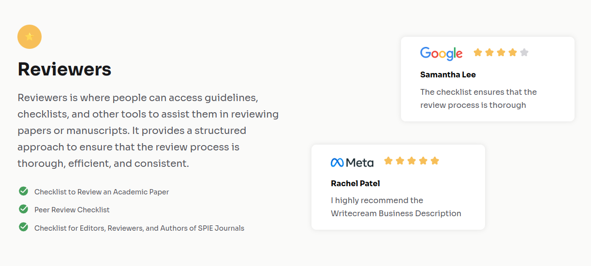
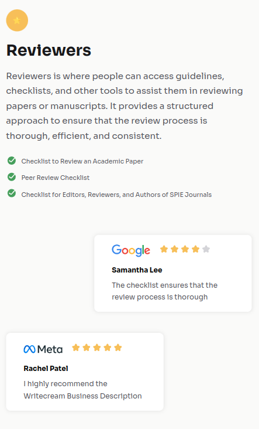

# Testimonial Page



<div align="center">

  
</div>

## Install dependencies

To get started, you'll need to install the required dependencies. Run the following command in your terminal:

```sh
pnpm install
```

## Development mode

To start the development server, use the command below:

```sh
pnpm dev
```

This will launch the application in development mode, allowing you to see changes in real time as you edit your code. You can access the application at [http://localhost:4321](http://localhost:4321).